# Onboarding Flow

This document reflects the current onboarding implementation in [onboarding_screen.dart](/Users/eug/Documents/glu-mobile-app/lib/screens/onboarding/onboarding_screen.dart).

## Mermaid

```mermaid
flowchart TD
  W["Welcome + affirmation<br/>Writes: onboarding_started_at"] --> MS["Are you currently taking a weight loss pen or pill medication?<br/>Options:<br/>- Yes, I'm taking it now<br/>- No, but I'm starting soon<br/>- No, I recently stopped<br/>Writes: medication_status"]

  MS -->|using| MM["How do you take your medication?<br/>Options:<br/>- Injection<br/>- Pill<br/>- I don't know yet<br/>Writes: medication_method"]
  MS -->|starting_soon or recently_stopped| PG["What's your primary goal right now?<br/>Options:<br/>- Lose weight<br/>- Maintain my weight<br/>- Manage my diabetes<br/>- Manage my PCOS<br/>- Improve my heart health<br/>Writes: primary_goal"]

  MM -->|injection| MN_SHOTS["Which medication are you taking?<br/>Shots list<br/>Writes: medication_name"]
  MM -->|pill| MN_PILLS["Which medication are you taking?<br/>Pill list<br/>Writes: medication_name"]
  MM -->|unknown| DEV["What device do you use to take your medication?<br/>Options:<br/>- Single pen<br/>- Auto-injector<br/>- Syringe and vial<br/>- Other<br/>Writes: device_type"]

  MN_SHOTS --> DOSE
  MN_PILLS --> DOSE

  DOSE --> DEV["What device do you use to take your medication?<br/>Options:<br/>- Single pen<br/>- Auto-injector<br/>- Syringe and vial<br/>- Other<br/>Writes: device_type"]
  DEV --> FREQ["How often do you take your medication?<br/>Options:<br/>- Every day<br/>- Every 7 days<br/>- Every 14 days<br/>- Custom<br/>Writes: medication_frequency<br/>If custom: medication_frequency_days_between_doses"]
  FREQ --> PG

  PG --> A["What's your age?<br/>Input: wheel picker 13-100<br/>Writes: age"]
  A --> H["What's your height?<br/>Input: ruler selector cm or ft/in<br/>Writes: height"]
  H --> CW["What's your current weight?<br/>Input: weight dial selector kg or lb<br/>Writes: weight"]
  CW -->|using or recently_stopped| START["Medication history step<br/>Using:<br/>- When did you start the medication?<br/>- starting weight<br/>Recently stopped:<br/>- When did you stop the medication?<br/>- most recent weight<br/>Writes: medication_started_at, medication_start_weight"]
  CW -->|starting_soon| GW["What's your goal weight?<br/>Input: weight dial selector kg or lb<br/>Default: current weight<br/>Shows target BMI indicator<br/>Writes: profiles.goals.weight"]
  START --> GW
  GW --> B["What Glu will help you do next<br/>Writes: onboarding_benefits_seen_at"]
  B --> N["Turn on reminders that support your goal<br/>Requests push permission<br/>Writes: notifications_prompted_at, notifications_permission_status"]
  N --> R["People use Glu to stay steady and supported<br/>Shows 5 stars + 3 testimonials<br/>Requests app review<br/>Writes: onboarding_review_prompted_at"]
  R --> DR["What's your daily routine?<br/>Options:<br/>- Sedentary<br/>- Lightly active<br/>- Active<br/>- Very active<br/>Writes: daily_routine"]
  DR --> SE["Which symptoms are you most concerned about, if any?<br/>Multi-select<br/>Writes: symptom_concerns"]
  SE --> G["How do you describe your gender?<br/>Options:<br/>- Male<br/>- Female<br/>- Prefer not to say<br/>- Other<br/>Writes: gender"]
  G --> PN["What should we call you?<br/>Input: preferred name<br/>Writes: preferred_name"]
  PN --> DONE["Complete onboarding<br/>Writes: onboarding_completed_at"]
```

## Branch Rules

- `medication_status == using`
  - Include medication-detail steps:
    - `medication_method`
    - `medication_name` only when method is not `unknown`
    - `current_dose_mg`
    - `device_type`
    - `medication_frequency`
- `medication_status == starting_soon` or `recently_stopped`
  - Skip all medication-detail steps and continue directly to `primary_goal`
- `medication_status == starting_soon`
  - Skip `medication_started`
- `medication_status == recently_stopped`
  - Keep the combined medication history step, but ask `When did you stop the medication?`
- `medication_method == unknown`
  - Skip `medication_name`
  - Skip `current_dose_mg`
- `medication_frequency == custom`
  - Show numeric input for `medication_frequency_days_between_doses`

## Question Inventory

1. `welcome`
   - Writes: `onboarding_started_at`

2. `medication_status`
   - Question: Are you currently taking a weight loss pen or pill medication?
   - Key: `medication_status`
   - Options:
     - `using`
     - `starting_soon`
     - `recently_stopped`

3. `medication_method`
   - Question: How do you take your medication?
   - Key: `medication_method`
   - Options:
     - `injection`
     - `pill`
     - `unknown`

4. `medication_name`
   - Question: Which medication are you taking?
   - Key: `medication_name`
   - Shown only when `medication_status == using` and `medication_method != unknown`
   - Injection options:
     - `Zepbound ®`
     - `Mounjaro ®`
     - `Tirzepatide`
     - `Wegovy ®`
     - `Semaglutide`
     - `Ozempic ®`
     - `Retatrutide`
     - `Saxenda ®`
     - `Victorza ®`
     - `Trulicity ®`
   - Pill options:
     - `Semaglutide Pill`
     - `Wegovy ® Pill`
     - `Rybelsus ®`

5. `current_dose_mg`
   - Question: What’s your current dose?
   - Key: `current_dose_mg`
   - Shown only when `medication_status == using` and `medication_method != unknown`
   - Options:
     - `2.5`
     - `5.0`
     - `7.5`
     - `10.0`
     - `12.5`

6. `device_type`
   - Question: What device do you use to take your medication?
   - Key: `device_type`
   - Options:
     - `Single pen`
     - `Auto-injector`
     - `Syringe and vial`
     - `Other`

7. `medication_frequency`
   - Question: How often do you take your medication?
   - Keys:
     - `medication_frequency`
     - `medication_frequency_days_between_doses` when custom
   - Options:
     - `daily`
     - `every_7_days`
     - `every_14_days`
     - `custom`

8. `primary_goal`
   - Question: What’s your primary goal right now?
   - Key: `primary_goal`
   - Options:
     - `Lose weight`
     - `Maintain my weight`
     - `Manage my diabetes`
     - `Manage my PCOS`
     - `Improve my heart health`

9. `age`
    - Question: What’s your age?
    - Key: `age`
    - Input: wheel picker, `13-100`

10. `height`
    - Question: What’s your height?
    - Key: `height`
    - Input shape:
      - metric: `{ unit: "metric", primary: "<cm>", secondary: null }`
      - imperial: `{ unit: "imperial", primary: "<feet>", secondary: "<inches>" }`

11. `weight`
    - Question: What’s your current weight?
    - Key: `weight`
    - Input shape:
      - kg: `{ unit: "kg", primary: "<value>", secondary: null }`
      - lb: `{ unit: "lb", primary: "<value>", secondary: null }`

12. `medication_started`
    - Question:
      - `using`: When did you start the medication?
      - `recently_stopped`: When did you stop the medication?
    - Keys:
      - `medication_started_at`
      - `medication_start_weight`
    - Combined step exception
    - Skipped when `medication_status == starting_soon`

13. `goal_weight`
    - Question: What’s your goal weight?
    - Writes: `profiles.goals.weight`
    - Uses `weight` as a visual fallback only
    - Shows BMI indicator based on `age + height + goal_weight`

14. `benefits`
    - Question: What Glu will help you do next
    - Key: `onboarding_benefits_seen_at`
    - Content-only interstitial with tailored benefit cards

15. `notifications_permission`
    - Question: Turn on reminders that support your goal
    - Keys:
      - `notifications_prompted_at`
      - `notifications_permission_status`
    - Requests native notification permission on continue
    - Content is tailored from previous answers

16. `review_prompt`
    - Question: People use Glu to stay steady and supported
    - Key: `onboarding_review_prompted_at`
    - Shows 5 stars and 3 testimonials
    - Requests native in-app review on continue when available

17. `daily_routine`
    - Question: What’s your daily routine?
    - Key: `daily_routine`
    - Options:
      - `Sedentary`
      - `Lightly active`
      - `Active`
      - `Very active`

18. `symptom_concerns`
    - Question: Which symptoms are you most concerned about, if any?
    - Key: `symptom_concerns`
    - Multi-select options:
      - `Anxiety`
      - `Belching`
      - `Bloating`
      - `Constipation`
      - `Diarrhea`
      - `Fatigue`
      - `Food noise`
      - `Hair loss`
      - `Heartburn`
      - `Indigestion`
      - `Injection site reaction`
      - `Metallic taste`
      - `Migraine`
      - `Mood swings`
      - `Nausea`
      - `Reflux`
      - `Stomach pain`
      - `Suppressed appetite`
      - `Vomiting`

19. `gender`
    - Question: How do you describe your gender?
    - Key: `gender`
    - Options:
      - `Male`
      - `Female`
      - `Prefer not to say`
      - `Other`

20. `preferred_name`
    - Question: What should we call you?
    - Key: `preferred_name`

21. completion
    - Writes: `onboarding_completed_at`

## Notes

- All current steps are configured as non-skippable.
- The app resumes onboarding from the first incomplete step.
- `notifications_permission` and `review_prompt` are persisted as completed onboarding steps.
- `Reset Onboarding` on the home screen removes the onboarding-related settings keys and routes the user back into this flow.
